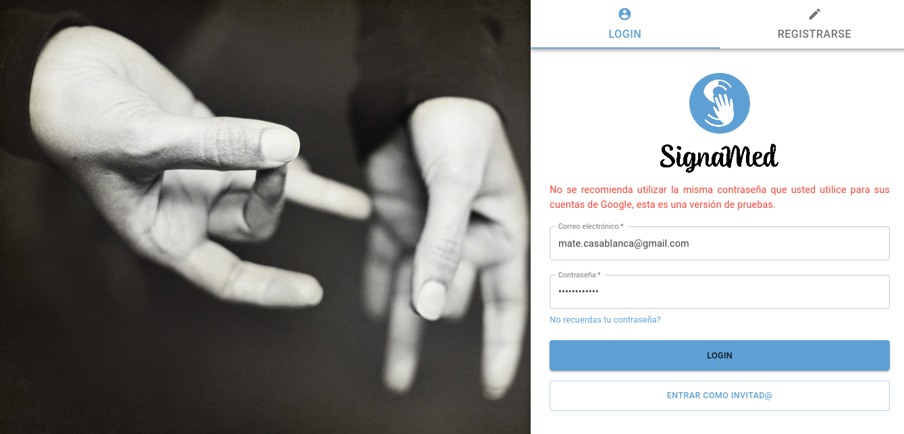
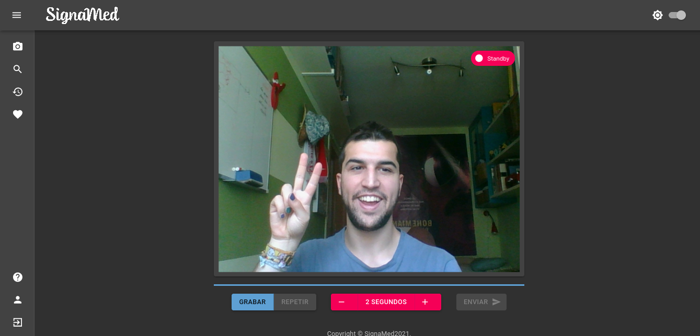
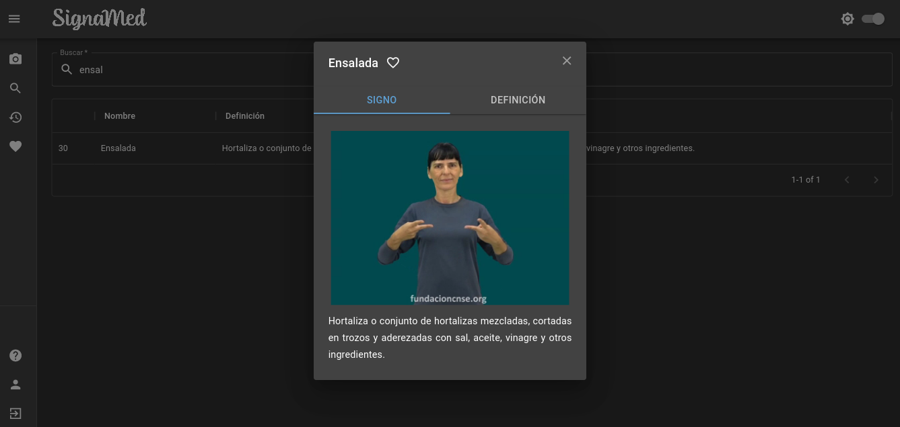
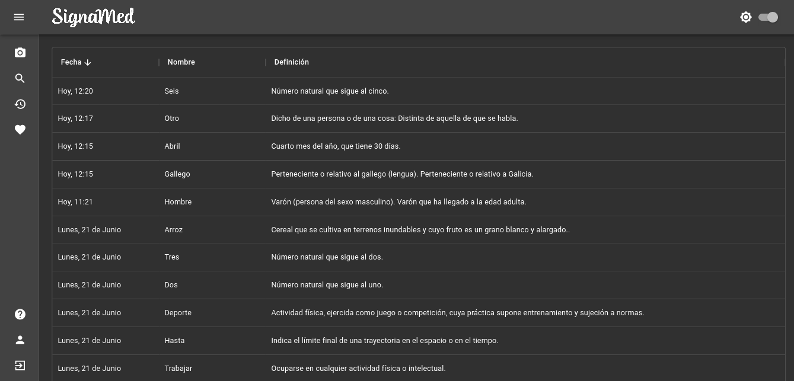

# SignaMed [WEB]

Repositorio público de la aplicación web llamada "SignaMed", accesible mediante el siguente link: https://signamed.web.app/

Para obtener más información sobre el proyecto visite: https://signamed.uvigo.es/

### Enlaces de las webs de pruebas con su tiempo de caducidad:

- Beta upload (11/02/2023) : https://signamed--beta-upload-9o7zdfmq.web.app
- Beta responsive (18/02/2023) : https://signamed--beta-responsive-zxa5pppe.web.app/sign
- Link puertas abiertas (31/01/2023) : https://signamed--puertas-abiertas-19hxnalh.web.app

### Screenhots Signamed web:

